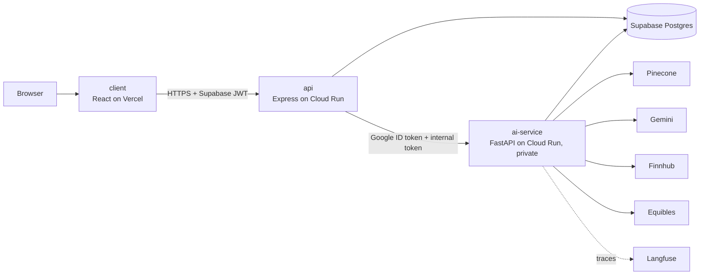

# Equity Lens

[](https://github.com/NMalpani17/equity-lens/actions/workflows/ci.yml)

AI investment research: track a portfolio and ask an analyst agent about
companies, earnings calls and your holdings, with every claim cited.

**Live demo: [equitylens-research.vercel.app](https://equitylens-research.vercel.app)**.
Click **Try demo**; no sign-up needed.


## Features

- **AI analyst chat.** Streamed answers about companies, earnings calls,
  markets and your portfolio, with inline citations that open the exact
  transcript passage. A LangGraph agent calls read-only tools over MCP:
  transcript search, quotes, price history, portfolio, company and fiscal-period
  resolution, and exact position math.
- **Earnings-call search (RAG).** Hybrid dense + keyword search over each
  company's last four earnings calls, reranked, with speaker and quarter on
  every passage. New tickers are indexed on demand.
- **Charts in answers.** Price and allocation charts built only from tool data,
  never from numbers the model wrote. They stream in with the answer and are
  saved with the conversation.
- **Portfolio tracking.** Lots grouped into positions with average cost,
  gain/loss and today's change. Live quotes come from Finnhub, with a yfinance
  fallback.
- **Accounts and instant demo.** Supabase Auth with password reset and account
  deletion. "Try demo" gives each visitor a private sample portfolio.
- **Graceful degradation.** A status dot shows when the AI service is waking
  from a cold start. One failing ticker or service never breaks the page.

## Architecture



The React client talks only to the **api**, a public Express gateway that
verifies Supabase sessions, enforces daily limits, stores portfolios and
conversations, and streams chat over SSE. The **ai-service** owns all LLM, RAG
and market-data logic. It runs as a private Cloud Run service that only the
api's service account can invoke.

## Tech stack

| Area           | Technologies                                                         |
| -------------- | -------------------------------------------------------------------- |
| Client         | React 19, TypeScript, Vite, Tailwind CSS v4, shadcn/ui, Recharts     |
| API            | Node.js 22, Express, TypeScript, Zod, Prisma, Pino                   |
| AI service     | Python 3.12, FastAPI, LangGraph, FastMCP, Gemini, Pinecone, Pydantic |
| Data           | Supabase (Postgres, Auth), Pinecone, Equibles, Finnhub, yfinance     |
| Infrastructure | Vercel, Google Cloud Run, Artifact Registry, Secret Manager, Docker  |
| Quality        | Vitest, Pytest, ESLint, Ruff, GitHub Actions CI, Langfuse            |

## Engineering highlights

- **Grounded answers.** Every company claim must cite a passage retrieved in the
  same turn; citation markers that don't match a retrieved passage are dropped
  before the answer is saved. Every figure comes from a tool result, and
  position math goes through a calculator tool, never the model. Retrieval
  quality is measured with a labelled 20-question set (hit rate@5 and MRR
  across dense, hybrid and hybrid + rerank, with and without context headers).
- **Evaluated with checks and a blind LLM judge.** 25 labelled questions run
  through the real agent. Each answer gets deterministic checks plus a rubric
  score from a judge that sees the answers anonymised and in shuffled order. In
  the recorded run (judge `gemini-3.1-pro-preview`), `gemini-3.8-flash` and
  `gemini-3.5-flash-lite` both passed 25/25 checks. Flash was more complete
  (5.00 vs 4.67) and was preferred 6 to 1 (11 ties); Flash-Lite cost about half
  per turn ($0.0028 vs $0.0059). Flash stays the default. Method and the
  judge-bias note are in [docs/development.md](docs/development.md#chat-evaluation).
- **Privacy-aware tracing.** Every chat turn is traced in Langfuse, including
  agent steps, tool calls with latency, and model calls with tokens and cost.
  User ids are hashed, and portfolio values, contact details and secrets are
  masked before export. Tracing is optional and can't slow or break a turn.
- **Guardrails.** Off-topic and prompt-injection requests are refused before
  the model runs. The agent gives facts rather than buy/sell advice, and daily
  per-user and global caps bound the spend.
- **Service-to-service auth.** The ai-service is deployed with
  `--no-allow-unauthenticated`. The api calls it with a cached Google ID token
  from the Cloud Run metadata server plus a separate internal-token header, and
  only the api's service account holds `roles/run.invoker`; direct calls get a 403.
- **Cold-start handling.** The ai-service scales to zero. A rate-limited
  warm-up fires after sign-in, chat streams start immediately with SSE
  keepalives and a connect timeout, and both services shut down within Cloud
  Run's 10-second grace period.

## Run locally

Prerequisites: Node.js 22+, Python 3.12+, a Supabase project, and API keys for
Finnhub, Gemini, Pinecone and Equibles.

```bash
cp client/.env.example client/.env      # then fill in each .env
cp api/.env.example api/.env
cp ai-service/.env.example ai-service/.env

npm install                             # root: Husky + concurrently
cd ai-service && python -m venv .venv && .venv/Scripts/pip install -r requirements-dev.txt && cd ..
npm --prefix api install && npm --prefix api run prisma:migrate
npm --prefix client install

npm run dev                             # client :5173, api :3001, ai-service :8000
```

On macOS/Linux the venv's pip is `.venv/bin/pip`. The environment variables,
Supabase setup, transcript seeding and per-service commands are in
[docs/development.md](docs/development.md).

## Documentation

- [docs/development.md](docs/development.md): local setup, configuration,
  RAG, chat, tracing and evaluation
- [docs/api.md](docs/api.md): API reference (gateway and ai-service)
- [docs/deployment.md](docs/deployment.md): Docker images and the Vercel, Cloud
  Run and Supabase setup
- [CLAUDE.md](CLAUDE.md): conventions, workflow and code-quality rules for
  contributors

## License

[MIT](LICENSE)
