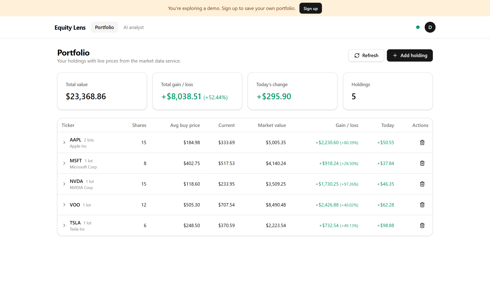

# Equity Lens

[](https://github.com/NMalpani17/equity-lens/actions/workflows/ci.yml)

An AI-powered investment research platform for tracking an equity portfolio with
live market data.

<!-- Screenshot: replace with a real image, e.g. docs/screenshot.png -->



**Live demo:** _coming soon_ <!-- replace with the deployed URL -->

## Features

- **User accounts** — email/password sign-up and login via **Supabase Auth**,
  with password reset (email link) and an account page showing your profile
  (email, member-since date) where you can change your password or delete your
  account (which removes all your data).
  The dashboard is behind a protected route, each user sees only their own
  holdings, and a **"Try demo"** button starts a per-visitor demo (anonymous
  sign-in) that the API auto-seeds with a sample portfolio.
- **Portfolio with lot grouping** — each purchase is its own lot; the dashboard
  groups lots by ticker into a position showing total shares, weighted-average
  cost, and combined market value, gain/loss, and today's change. Expand a
  position to see and edit individual lots (with an optional purchase date).
- **Live prices** — quotes from **Finnhub** (primary) with an automatic
  **yfinance** fallback on failure or rate limiting, plus a short-lived cache.
- **Invalid-ticker validation** — new tickers are verified against the market
  data service; unknown symbols are rejected with a clear message.
- **Graceful degradation** — one bad ticker never breaks the batch, unpriced
  holdings are excluded from totals (shown as partial), and the UI reports when
  the AI service is unavailable instead of failing.

## Architecture

```
Browser ──▶ client/ (React) ──▶ api/ (Express) ──▶ ai-service/ (FastAPI)
```

The **client** talks only to the **api**, which is the gateway: it persists
holdings (Supabase/Prisma) and orchestrates calls to the **ai-service**, which
owns market data (and, in later phases, all LLM logic).

## Tech stack

| Part          | Stack                                                         | Port   |
| ------------- | ------------------------------------------------------------- | ------ |
| `client/`     | React 19, TypeScript, Vite, Tailwind CSS v4, shadcn/ui        | `5173` |
| `api/`        | Node.js, TypeScript, Express, Zod, Pino, Prisma (Supabase PG) | `3001` |
| `ai-service/` | Python 3.12, FastAPI, Pydantic, Uvicorn, Finnhub + yfinance   | `8000` |

## Quick start

**Prerequisites:** Node.js 20+, Python 3.12+, Git, a [Supabase](https://supabase.com)
project (PostgreSQL), and a free [Finnhub](https://finnhub.io/dashboard) API key.

```bash
# 1. Env: copy the examples, then fill in the secrets (see below)
cp client/.env.example client/.env
cp api/.env.example api/.env
cp ai-service/.env.example ai-service/.env

# 2. Install
npm install                                   # repo root (Husky + concurrently)
cd ai-service && python -m venv .venv && .venv\Scripts\activate \
  && pip install -r requirements-dev.txt && deactivate && cd ..
npm --prefix api install                      # also runs `prisma generate`
npm --prefix api run prisma:migrate           # creates/updates tables (first run)
npm --prefix client install

# 3. Run all three services together
npm run dev
```

Fill in the required secrets before running:

- `ai-service/.env` → `AI_SERVICE_FINNHUB_API_KEY`
- `api/.env` → `DATABASE_URL` (pooled) and `DIRECT_URL` (direct) from Supabase,
  `SUPABASE_URL` (verifies user JWTs), and `SUPABASE_SERVICE_ROLE_KEY`
  (server-only; used to delete a user's auth account).
- `client/.env` → `VITE_SUPABASE_URL` and `VITE_SUPABASE_PUBLISHABLE_KEY`.

**Auth setup:** in your Supabase project, enable **Email** auth and (for local
dev) turn off email confirmation so sign-ups log in immediately; enable
**Anonymous sign-ins** to power the "Try demo" button. The API verifies access
tokens against the project's JWKS, so the project must use Supabase's asymmetric
JWT signing keys (the default for new projects). No demo credentials are needed —
each visitor gets their own temporary user, seeded with a sample portfolio.

Then open <http://localhost:5173>. Never commit `.env` files — only
`.env.example` is tracked.

More detail: **[docs/development.md](docs/development.md)** (per-service run
steps, scripts, health checks) and **[docs/api.md](docs/api.md)** (API reference).

## Contributing

Branch per feature, Conventional Commits, and merge only when CI is green.
Engineering standards, workflow, and code-quality rules live in
[`CLAUDE.md`](./CLAUDE.md).
